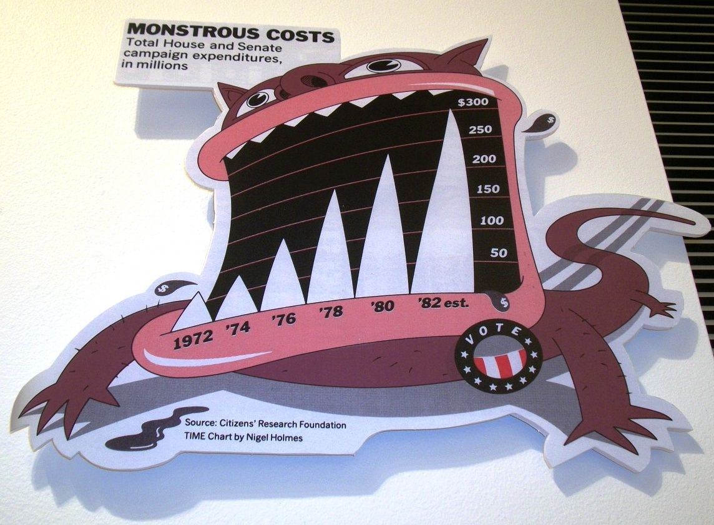
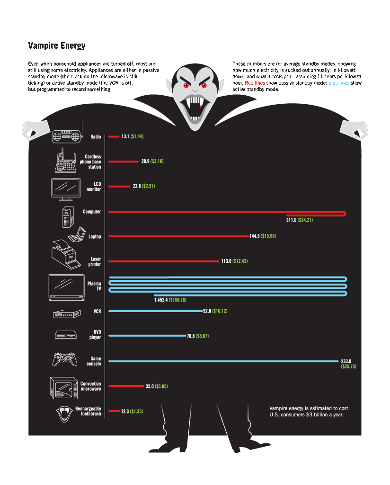
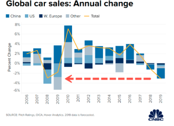
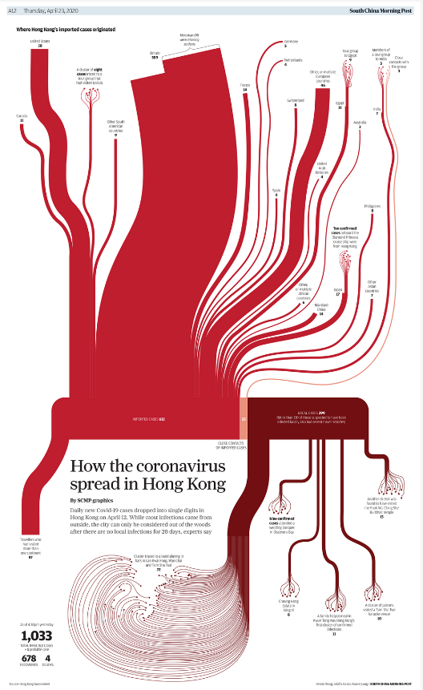

# Chart 9:

The chart is so-so.

The animated monster theme is good. And the data source is sited, which is also a good point.

However, the title is “monstrous costs” while the sub title is more official and specific for this chart, so the title and sub title should be switched. Ang the title should be bigger for readers.

In addition, the x-axis and y-axis have no label. They should be labeled “Year” and “Cost/ millions”.

# Chart 10:

The chart is good but has a little problem.

The title is “ Vampire Energy” and the chart has some context to explain what is this concept.

However, the data scale may have some problem because the least and the most electrical appliances have a big difference.

Moreover, the order of appliances should be descending by their electricity costs. In that case, readers could quickly know which appliance costs most.

# Chart 12:

The chart is bad.

The legends’ color are close to each other. They are all blue, some are lighter and some are darker, which is hard for reader to figure when they read the chart. The chart should use different colors,
like blue, red green and yellow.

And there is a red arrow in the chart without any explanation which is really confused. The chart should add one more legend to explain what is this red arrow, or has some context.

# Chart 13:

link:https://multimedia.scmp.com/culture/article/SCMP-printed-graphics-memory/lonelyGraphics/202004A256.html

The chart is bad.

It divides the coronavirus cases into 3 part, which is a good idea, but the blood theme is too terrible to read and understand. The country and area names and context are labeled in each branch, which means the reader may track all the way to the end of the branch.

It can be visualized as a simple bar chart and that may be more efficient for readers to read.