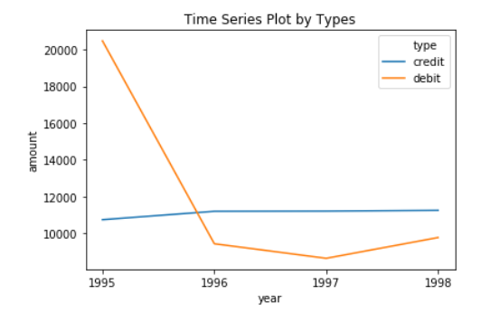
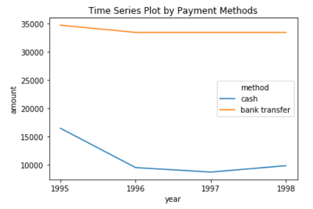
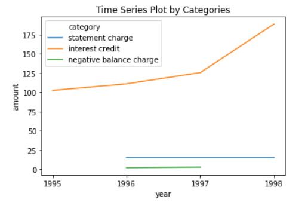

# Task 1 (R)
```{r}
# Load Data
account <- read.csv('data/accounts_analytical.csv')
transactions <- read.csv('data/transactions.csv')
```

```{r warning=FALSE, message=FALSE}
# Import packages
library(VIM)
library(mice)
library(ggplot2)
library(ggthemes)
library(dplyr)
library(lubridate)
library(viridis)
library(scales)
library(plyr)
```

```{r warning=FALSE, message=FALSE}
# Combine all 3 characteristics together
account <- read.csv('data/accounts_analytical.csv')
account$card[is.na(account$credit_cards)] ='Have credit card(s)'
account$card[!is.na(account$credit_cards)] ='No credit card'
account$loan[is.na(account$loan_amount)] ='Have loan'
account$loan[!is.na(account$loan_amount)] ='No loan'
account$average_balance = (account$max_balance + account$min_balance) / 2
ggplot(data=account, mapping = aes(x = average_balance, y = card))+
  geom_point(mapping=aes(color=loan))+
  ggtitle('Combined characteristics of accounts \n (Credit Card, Loan, Average Balance)')+
  theme_economist()
```
## Whether an account has a loan or not

Same processing as the former question.

```{r}
loan <- ggplot(data = account,aes(x = loan_status,fill=loan_status))+
  geom_bar()+
  labs(x = 'loan status', y = 'count')+
  ggtitle("The count number of different loan status")+
  geom_text(stat='count',aes(label = ..count.., y = ..count..))+
  scale_x_discrete(labels=c("Not Sure(NA)","current","expired"))+
  guides(fill=FALSE)

loan
```

Now, as the hisogram shows, we could clearly know there are 3818 accounts don't have loan (ther are NA value so we are not sure they have loan or not), 448 accounts have loan for curren timeand 234 accounts are in expired.

## The average balance for the account

The average balance means (max+min)/2
```{r}
account$mean_balance = (account$max_balance + account$min_balance) / 2
```

```{r}
avg_balance <- ggplot(account,aes(x=mean_balance)) +
  geom_histogram(aes(y=..density..),
                 binwidth = 10000,
                  colour = 'blue', fill = 'grey') +
  geom_density(alpha=0.2,fill='pink')

avg_balance
```

As we can see, the distribution of the average balance is skwed noraml distribution.

# Task 2 (R)

```{r}
# Load data
account <- read.csv('data/accounts_analytical.csv')
transactions <- read.csv('data/transactions.csv')
```

# What is the distribution of all loans and what are their characteristics?

## distribution of loan_term
```{r}
loan_term_counts = as.data.frame(table(account$loan_term))
ggplot(loan_term_counts,aes(x=as.factor(Var1),y=as.factor(Freq),fill=Var1)) +
  geom_bar(stat='identity') +
  xlab("loan_term") +
  ylab("count") +
  ggtitle('the frequency of loan term')
```

As we can see,when loan term is 36 months, it has the least count, but other loan terms has simialr counts by the distribution of loan_term.

## Distribution of loan amount in different loan status
```{r, warning=FALSE}
ggplot(account, aes(x=loan_amount, fill=loan_status)) +
  geom_histogram(alpha=.5, position="identity") +
  ggtitle('The distribution of loan amount in different loan status')+
  theme_economist()
```

As we can see, the distribution of loan amount in current loan status is similar to the expired's.

## Generally Analytics
```{r}
loans <- account[,c('loan_date','loan_amount','loan_payment','loan_term', 'loan_status', 'loan_default')]
loans <- na.omit(loans)
loans$loan_default <- ifelse(loans$loan_default == "TRUE", 'default',
                      ifelse(loans$loan_default == "FALSE", 'not default', NA))
default_only = subset(loans, loan_default == 'default')
default_only$loan_paid = default_only$loan_payment / default_only$loan_amount
all <- ggplot(data=default_only, mapping=aes(x=loan_amount, y=loan_payment,size=loan_paid, shape=factor(loan_term),alpha=0.5))+
  geom_point() +
  ggtitle("Distribution of Default Loans \n with Loan Term, Payment, and Amount")+
  guides(color = FALSE, alpha = FALSE)

all
```

As we can see, the graph shows that in the default loans,

when the loan amoint is larger and the loan term is longer,

accounts pay less.

# Task 3 (R)

```{r}
# Load data
account <- read.csv('data/accounts_analytical.csv')
transactions <- read.csv('data/transactions.csv')
```

# Is there a relationship between a good or bad loan and the time between an account is opened an the loan is created? Is there a specific set of accounts that seem to be at higher or lower risk of defaulting?

```{r message=FALSE}
account['accounts_year'] = year(account$acct_creation_date)
account['accounts_day'] = day(account$acct_creation_date)
account['accounts_weekend'] <- account$day %in% c("Sat", "Sun")
account['month'] <- month(account$acct_creation_date)
account['accounts_holiday'] <- with(account,ifelse(month >= 2 & month <= 5, 'Spring',
                                                   ifelse(month >= 6 & month <= 8, 'Summer',
                                                          ifelse(month >= 9 & month <= 11,'Autumn', 'Winter'))))
account$loan_date[grepl("^ *$",account$loan_date)] <- NA
account['loan_year'] = year(account$loan_date)
account['loan_day'] = day(account$loan_date)
account['loan_weekend'] <- account$day %in% c("Sat", "Sun")
account['month'] <- month(account$loan_date)
account['loan_holiday'] <- with(account,ifelse(month >= 2 & month <= 5, 'Spring',
                                               ifelse(month >= 6 & month <= 8, 'Summer',
                                                      ifelse(month >= 9 & month <= 11,'Autumn', 'Winter'))))
```

## accounts created in each year
```{r}
ggplot(data=account,aes(accounts_year)) +
  geom_line(stat='count',) +
  ggtitle('The count of accounts created in each year')+
  theme_economist()
```

As the line plot shows, in 1996, there are most accounts created while 1994 has the least.

## loan satuts and loan default change by years 
```{r}
year_loan_status_counts = account %>% group_by(accounts_year,loan_status) %>% count()
year_loan_status_counts$loan_status = sub("^$", "Unknown", year_loan_status_counts$loan_status)
ggplot(year_loan_status_counts,aes(accounts_year,fill=loan_status))+
  geom_bar(position="stack")+
  labs(x = "Year")+
  ggtitle('The Loan Status change by years')+
  theme_economist()
```

As the stack bar plot shows, in 1993, there are most accounts expired while in 1997, it has the least amount of expired loan accounts.

In 1996, it has the most amount of current loan accounts while in 1994, it has the least current loan accounts.

```{r}
year_loan_default_counts = account %>% group_by(accounts_year,loan_default) %>% count()
year_loan_default_counts$loan_default[is.na(year_loan_default_counts$loan_default)] <- 'Unknown'
ggplot(year_loan_default_counts,aes(accounts_year,fill=loan_default))+
  geom_bar(position="stack")+
  labs(x = "Year")+
  ggtitle('The Loan Default change by years')+
  theme_economist()

```

The result is very similar to the loan status change by years.

Therefore, the loan status and loan default is not related with the account created date.

And, the loan status is related with loan created date, because with the time going, the current loan is very likely changing to expired and the other loan accounts are tend to be default.

## higher or lower risk of defaulting
```{r, results = "hide"}
account %>% filter(loan_default=='TRUE')
```
```{r  message=FALSE, warning=FALSE}
higher_risk = account %>% filter(min_balance <= 0)
higher_risk$loan_default[is.na(higher_risk$loan_default)] <- 'Unknown'
higher_risk = higher_risk %>%
  group_by(loan_default) %>%
  dplyr::summarise(counts = n()) %>%
  mutate(percentages = round(counts/sum(counts)*100,2))
ggplot(data=higher_risk,aes(x=factor(1),y=counts,fill=loan_default)) +
  geom_col(aes(fill = loan_default), width = 1) +
  geom_text(aes(label = percentages), position = position_stack(vjust = 0.5)) +
 coord_polar("y") + ggtitle('The distribution of higher default loan risk accounts')
```

As the pie chart shows, the accounts all are higher risk default loan.

## Top min balance vs. higher risk
```{r}
n = 15
Top_10_min_balance = subset(account, min_balance > quantile(min_balance, prob = 1 - n/100))
ggplot(data=Top_10_min_balance,aes(loan_default)) +
  geom_bar(stat='count', fill = 'pink', color= 'grey')+
  theme_economist()
```

As the result shows, min_balance may be an important factor of higher risk of default loan.

# Task 4 (R)

```{r}
# Load data
account <- read.csv('data/accounts_analytical.csv')
transactions <- read.csv('data/transactions.csv')
```


# For the account with the highest number of transactions, make a time series line plot for the behavior of the account over time, including all debits and credits, the different methods, and the with the different categories.

```{r}
num_trans = transactions %>% dplyr::count(account_id) 
names(num_trans)[names(num_trans)=='n'] <- 'transaction_count'
num_trans <- num_trans[order(-num_trans$transaction_count),]
head(num_trans)
```

As we can see, account id 8261 has the most transaction records, 675 times.

### Processing
```{r}
high_trans <- filter(transactions, account_id == 8261)
head(high_trans)
high_trans$date <- as.Date(high_trans$date, "%Y-%m-%d")
head(high_trans)
```

### Time Series Plot by Types
```{r}
ggplot(high_trans, aes(x = date, y = amount)) + 
  geom_line(aes(color = type), size = .75) +
  ggtitle("Time Series Plot by Types")+
  theme_economist()
```

### Time Series Plot by Payment Methods
```{r}
high_trans_method <- subset(high_trans, method == 'cash' | method == 'bank transfer')
ggplot(data = high_trans_method, aes(x = date, y = amount))+
  geom_line(colour = 'orchid3',size = .5)+ 
  facet_wrap(~method, ncol=1)+ 
  ggtitle("Time Series Plot by Payment Methods")+
  theme_economist()
```

### Time Series Plot by Categories
```{r}
high_trans_cate <- subset(high_trans, category == 'household payment' | category == 'insurance payment' | category == 'loan payment'| category == 'interest credit' | category == 'statement charge')
ggplot(high_trans_cate, aes(x = date, y = amount)) + 
  geom_line(aes(color = category), size = .75) +
  ggtitle("Time Series Plot by Categories")+
  theme_economist()
```

# Task 4 (Python)

```{python eval = FALSE, message = FALSE, warning = FALSE}
# Import packages
import pandas as pd
import numpy as np
import matplotlib.pyplot as plt
import seaborn as sns

# Read data
account = pd.read_csv('data/accounts_analytical.csv')
transactions = pd.read_csv('data/transactions.csv')
account.head()
transactions.head()

# Find the account with the highest number of transactions
transactions.groupby(['account_id']).size().reset_index(name='counts').max()

# so the account_id = 11382 has the most transaction records, 675 times.
highest_tran = transactions[transactions['account_id'] == 11382]

# For the account with the highest number of transactions,
# make a time series line plot for the behavior of the account over time,
# including all debits and credits, the different methods, and the with the different categories.
highest_tran['year'] = pd.DatetimeIndex(highest_tran['date']).year

highest_tran.head()

# Time Series Plot by Types
type = sns.lineplot(x="year", y="amount", hue ='type', ci = None, data=highest_tran)
type.set_title('Time Series Plot by Types')
plt.xticks([1995,1996,1997,1998])

# Time Series Plot by Payment Methods
method = sns.lineplot(x="year", y="amount", hue ='method', ci =None, data=highest_tran)
method.set_title('Time Series Plot by Payment Methods')
plt.xticks([1995,1996,1997,1998])
```





# Task 5 (R)

```{r}
# Load data
account <- read.csv('data/accounts_analytical.csv')
transactions <- read.csv('data/transactions.csv')
```

# Explore the validity of the data for the case whether or not an account has a credit card and whether or not they have associated credit card transactions. Is there anything worth noting?
```{r}
transactions_d = transactions[transactions$type != 'debit',] %>% select(account_id,type)
transactions_dd = transactions_d %>% group_by(account_id,type) %>% distinct()
card <- merge(account, transactions_dd, by="account_id")
dim_card = dim(card)
dim_card_null = dim(card[is.na(card$credit_cards),] %>% filter(credit_bank_transfer_other_txn_ct!=0 | credit_bank_transfer_other_txn_tot != 0 |credit_bank_transfer_other_avg_txn != 0 | credit_cash_other_txn_ct!= 0))
df <- data.frame(value = c(dim_card[1],dim_card_null[1]), Group = c("No Credit Card", "No Credit Card But Transaction")) %>%
  mutate(Group = factor(Group, levels = c("No Credit Card", "No Credit Card But Transaction")),cumulative = cumsum(value),midpoint = cumulative - value / 2,
         label = paste0(round(value / sum(value) * 100, 1), "%"))
colors <- c('grey50','pink1')
ggplot(df,aes(x = 1, weight = value, fill = Group)) +
  ggtitle('The Pir Chart of Having Transactions \n by Credit Cards Status')+
   geom_bar(width = 1, position = "stack",color = colors) +
   coord_polar(theta = "y") +
   geom_text(aes(x = 1.3, y = midpoint, label = label))+
  theme_base()+
  theme(axis.line.x=element_blank(),
          axis.text.x=element_blank(),
          axis.ticks.x=element_blank(),
        axis.line.y=element_blank(),
          axis.text.y=element_blank(),
          axis.ticks.y=element_blank())
```

As the pie chart shows, 54.4% accounts doesn't not have credit card but they have transactions.


