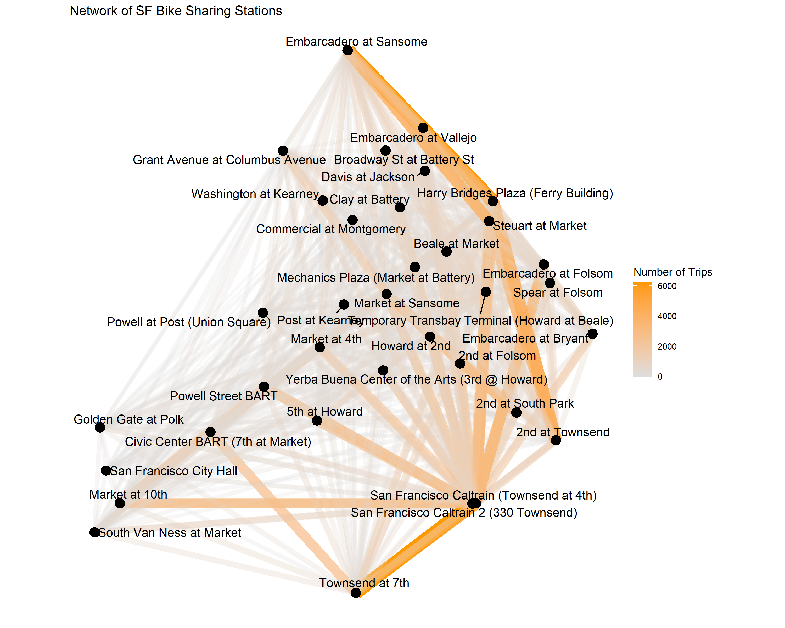

**Dataset**:

SF Bay Area Bike Share (https://www.kaggle.com/benhamner/sf-bay-area-bike-share)

**Description**:

* *Station-* Data relating to the geographical location of 70 bike stations, their id, name, city, installation date and dock count. It has 70 observations and 7 variables.

* *Status-* Time series data relating to bikes and docks available for each station. This table has 71984434 observations and 4 variables.

* *Trip-* This table has data related to each trip over the three years. This table has 669959 observations and 11 variables.

* *Weather-* This table has data relating to daily weather conditions of each city over the three years. It has 3665 observations and 25 variables.


# Import Packages
```{r warning=FALSE, echo=TRUE, message=FALSE}
library(data.table)
library(ggplot2)
library(ggrepel)
library(readr)
library(dplyr)
library(lubridate)
library(viridis)
library(scales)
library(ggthemes)
library(RSQLite)
library(sqldf)
library(leaflet)
library(networkD3)
library(reshape2)
library(plotly)
library(stringr)
library(lubridate)
library(fasttime)
library(tidyr)
library(gridExtra)
library(DT)
library(Hmisc)
library(GGally)
```

# Data Processing

### read data
```{r echo=TRUE, message=FALSE,warning=FALSE,fig.width=10}
station_csv <- fread("data/station.csv",showProgress = FALSE)
status_csv <- fread("data/status.csv",showProgress = FALSE)
trip_csv <- fread("data/trip.csv",showProgress = FALSE)
weather_csv <- fread("data/weather.csv",showProgress = FALSE)
```

```{r echo=TRUE, message=FALSE,warning=FALSE}
datatable(head(station_csv,10))
datatable(head(status_csv,10))
datatable(head(trip_csv,10))
datatable(head(weather_csv,10))
```

### Cleaning and formating

* Missing Values.

* Uniform the date.

* Station dataset: installation_date needs to be changed from character to date.

* Status: time needs to be changed to POSIXct.

* Trip:  start_date and end_date need to be changed to POSIXct.

* Weather: "Rains and rains" needs to keep 'R' capital for both; blank events need to be as Normal Day.

* Removing outliers.

```{r message=FALSE}
station_csv$installation_date <- mdy(station_csv$installation_date)
status_csv$time <- fastPOSIXct(status_csv$time,tz="America/Chicago")
trip_csv$start_date <- mdy_hm(trip_csv$start_date,tz="America/Chicago")
trip_csv$end_date <- mdy_hm(trip_csv$end_date,tz="America/Chicago")
weather_csv$date <- mdy(weather_csv$date,tz="America/Chicago")
weather_csv$precipitation_inches[weather_csv$precipitation_inches=='T']<-0.01
weather_csv$precipitation_inches<-as.numeric(weather_csv$precipitation_inches)
weather_csv$events[weather_csv$events=='rain']<-"Rain"
weather_csv$events[weather_csv$events=='']<-"Normal Day"
colSums(is.na(station_csv))
colSums(is.na(status_csv))
colSums(is.na(weather_csv))
colSums(is.na(trip_csv))
```

```{r}
#summary(station)
#summary(status)
#summary(weather)
#summary(trip)
```

The maximum duration of a trip is 287899.00 minutes which is impossible.

Therefore, I assume that duration is beyond 5 days(7200 mins) as an outlier. 

Then remove outliers.

```{r}
trip_csv$trip_duration <- as.numeric((trip_csv$end_date-trip_csv$start_date))
trip_csv$duration <- NULL
summary(trip_csv$trip_duration)
trip_csv = trip_csv[trip_csv$trip_duration < 7201,]
summary(trip_csv$trip_duration)
```

Add longitude and latitude columns in the status and the trip datasets

```{r , echo=TRUE, message=FALSE,warning=FALSE}
colnames(station_csv)[1]<-"station_id"
# latitude and longitude for each station
trip1 <- sqldf('select trip_csv.*,station_csv.lat as source_lat,station_csv.long as source_long from trip_csv 
               left outer join station_csv 
               where trip_csv.start_station_id = station_csv.station_id')
tripFinal <- sqldf('select trip1.*,station_csv.lat as dest_lat,station_csv.long as dest_long from trip1
                   left outer join station_csv 
                   where trip1.end_station_id = station_csv.station_id')
# valid zipcodes for cities
MountainView<-c(94039,94040,94041,94042,94043,94085,94303)
RedwoodCity<-c(94002,94061,94062,94063,94064,94065,94070)
SanFrancisco<-c(94102,94104,94103,94105,94108,94107,94110,
                94109,94112,94111,94115,94114,94117,94116,
                94118,94121,94123,94122,94124,94127,94126,
                94129,94131,94133,94132,94134,94139,94143,
                94151,94159,94158,94188,94177)
PaloAlto<-c(94022, 94040, 94043, 94301, 94303, 94304, 
            94305, 94306, 95014, 95033)
SanJose<-c(94089, 95002, 95008, 95013, 95014,
           95032, 95035, 95037, 95050, 95054,
           95070, 95110, 95111, 95112, 95113,
           95116, 95117, 95118, 95119, 95120,
           95121, 95122, 95123, 95124, 95125,
           95126, 95127, 95128, 95129, 95130,
           95131, 95132, 95133, 95134, 95135,
           95136, 95138, 95139, 95140, 95148)

# Remove invalid zipcodes and add city name 
validZipCodes<-c(MountainView,RedwoodCity,SanFrancisco,PaloAlto,SanJose)
tripFinal<-filter(tripFinal,zip_code %in% validZipCodes)
tripFinal$city<-ifelse(tripFinal$zip_code %in% MountainView,'Mountain View',ifelse(tripFinal$zip_code%in% RedwoodCity,'Redwood City',ifelse(tripFinal$zip_code%in%SanFrancisco,'San Francisco',ifelse(tripFinal$zip_code%in% PaloAlto,'Palo Alto','San Jose'))))
weather_csv$city<-ifelse(weather_csv$zip_code %in% MountainView,'Mountain View',ifelse(weather_csv$zip_code%in% RedwoodCity,'Redwood City',ifelse(weather_csv$zip_code%in%SanFrancisco,'San Francisco', ifelse(weather_csv$zip_code%in% PaloAlto,'Palo Alto','San Jose'))))
```

Then data has been processed.
```{r}
datatable(head(station_csv,10))
datatable(head(status_csv,10))
datatable(head(tripFinal,10))
datatable(head(weather_csv,10))
```

# Exploratory and Visualizaton

### Start and End Trips For Each Station.

```{r warning=FALSE, echo=TRUE, message=FALSE, fig.width=16, fig.height=16}
db <- dbConnect(dbDriver("SQLite"), "data/database.sqlite")
station <- dbGetQuery(db, "
SELECT start.name, num_trips_start, num_trips_end
FROM (SELECT DISTINCT s.name, COUNT(DISTINCT t.Id) num_trips_start
FROM trip t
INNER JOIN station s ON t.start_station_id=s.id 
group by s.name) start
left join
(SELECT DISTINCT e.name, COUNT(DISTINCT t.Id) num_trips_end
FROM trip t
INNER JOIN station e ON t.end_station_id=e.id 
group by e.name) end
on start.name=end.name
")

station %>%melt() %>%ggplot(aes(reorder(name, value),value, fill=variable)) +
  labs(title = 'Total Start and End trips for each station')+
  geom_bar (stat = "identity") +
  coord_flip() +theme_economist()
```

### Short Trips VS. Long Trips

```{r,echo=TRUE, message=FALSE, warning=FALSE}
summary(tripFinal$trip_duration)
```

* Short Trips (trip duration < 14 minutes)
* Long Trips (trip duration >24 hours)

```{r, echo=TRUE,warning=FALSE}
tripShort<-tripFinal[tripFinal$trip_duration<14,]
tripLong<-tripFinal[tripFinal$trip_duration>=1440,]
```

```{r,echo=TRUE, message=FALSE,warning=FALSE,fig.width=10}

d1<-density(tripShort$trip_duration)
d2<-density(tripLong$trip_duration)
p <- plot_ly() %>%
  add_trace(type = 'histogram', name = 'Short Trips',nbinsx = 60,opacity=0.3,x = tripShort$trip_duration, visible=T, marker = list(color = 'black'))%>%
  add_trace(x = d1$x, y = d1$y, type = "scatter", mode = "lines", fill = "tozeroy", yaxis = "y2", name = "Density",visible=T)%>% 
  add_trace(type = 'histogram', name = 'Long Trips',nbinsx = 200,opacity=0.3,x = tripLong$trip_duration, visible=F, marker = list(color = 'black')) %>%
  add_trace(x = d2$x, y = d2$y, type = "scatter", mode = "lines", fill = "tozeroy", yaxis = "y2", name = "Density",visible=F) %>% 
  layout( title="Histogram of the trip duration",
          xaxis = list(title = "Trip Duration"),
          yaxis = list(title = "Frequency"),
          yaxis2 = list(overlaying = "y", side = "right"),
          updatemenus = list(
            list(yanchor = 'auto',
              buttons = list(
                list(method = "restyle",
                     args = list("visible", list(T,T,F, F)),
                     label = 'Short Trips'),
                list(method = "restyle",
                     args = list("visible", list(F,F,T,T)),
                     label = 'Long Trips')
              ))))
p

```


In Short Trips, the maximum number of trips are between 5 to 10 minutes while it decreases when the duration is long.

In Long Trips. the number of trips decreases when the duration increases


### Network of SF Bike Sharing Stations

```{r}
db <- dbConnect(dbDriver("SQLite"), "data/database.sqlite")

trips <- dbGetQuery(db, "
SELECT s.lat start_lat,
       s.long start_long,
       e.lat end_lat,
       e.long end_long,
       COUNT(DISTINCT t.Id) num_trips
FROM trip t
INNER JOIN station s ON t.start_station_id=s.id 
INNER JOIN station e on t.end_station_id=e.id
WHERE s.city='San Francisco'
  AND e.city='San Francisco'
GROUP BY s.lat, s.long, e.lat, e.long")

stations <- dbGetQuery(db, "SELECT * FROM station WHERE city='San Francisco'")
```

```{r}

p <- ggplot(trips) +
  labs(title = 'Network of SF Bike Sharing Stations')+
     geom_segment(aes(x=start_long, xend=end_long, y=start_lat, yend=end_lat, size=num_trips, colour=num_trips, alpha=num_trips)) +
     geom_point(data=stations, aes(x=long, y=lat), size=4) +
     geom_text_repel(data=stations, aes(x=long, y=lat, label=name), size=4) +
     theme_light(base_size=10) +
     scale_colour_gradientn(colors=c("#dddddd", "#ff9900"), limits=c(0, max(trips$num_trips)), name="Number of Trips") +
     scale_alpha(limits=c(0, max(trips$num_trips)), guide=FALSE) +
     scale_size(limits=c(0, max(trips$num_trips)), guide=FALSE) +
     xlab("") +
     ylab("") +
     coord_fixed() +
     theme(axis.line=element_blank(),
           axis.text.x=element_blank(),
           axis.text.y=element_blank(),
           axis.ticks=element_blank(),
           axis.title.x=element_blank(),
           axis.title.y=element_blank(),
           panel.grid=element_blank(),
           panel.border=element_blank())

ggsave("sf_trips.png", p, width=10, height=8, units="in")
```



As we can see, each line represents a start-end relationship between two stations. And the color is darker, more bikes travel between the stations. In San Francisco, Embarcadero at Sansome, Embarcadero ar Vallejo, Townsend at 7th and 2nd at Townsend have more high bike counts.


###  Geographical Analysis of Each Station

```{r}
stationLabel<-paste0(station_csv$name,", Docks:",station_csv$dock_count)
pal <- colorNumeric(c("Reds"), station_csv$dock_count)
leaflet(data = station_csv) %>% addProviderTiles("CartoDB.DarkMatter") %>%addCircleMarkers(~long, ~lat, radius = 5, color = ~pal(dock_count),fillOpacity =0.2,weight=1,label=stationLabel)
```


As we can see, each circle represents a station. And the color is darker, more dock count for that station. San Francisco has more high dock counts stations.

### Analyze Trips Between Stations in Geographical and Network.

Combine network and geospatial work.

Visualize top 50 routes in red lines, rest of them are yellow. 

Visualize top 20 stations where most trips start and end in red, and rest of them are white. (Notice: some bikes start and end in the same station so they are not included.)

```{r,echo=TRUE, message=FALSE,warning=FALSE,fig.width=10}
trips_between <- tripFinal%>% group_by(source_lat,source_long,dest_lat,dest_long)%>%summarise(trips=n())

trips_betweenStations<-sqldf('select s.name as source,t.* from station_csv s inner join trips_between t on s.lat=t.source_lat and s.long=t.source_long')
trips_betweenStations<-sqldf('select s.name as dest,t.* from station_csv s inner join trips_betweenStations t on s.lat=t.dest_lat and s.long=t.dest_long')
trips_betweenStations<-filter(trips_betweenStations,source==dest)
trips_betweenStations<-arrange(trips_betweenStations,desc(trips))

# List of top 20 stations
trips_betweenStations<-trips_betweenStations[1:20,]

# list to top 50 routes
trips_betweenSorted<-arrange(trips_between,desc(trips))
trips_betweenSorted<-trips_betweenSorted[1:50,]

leaflet(data = station_csv) %>%addTiles() %>%addProviderTiles("CartoDB.DarkMatter") %>%
  addPolylines(lat=c(trips_between$source_lat, trips_between$dest_lat),lng=c(trips_between$source_long, trips_between$dest_long), color="#99FF99",weight=1,fillOpacity = 0.1)%>%
  addPolylines(lat=c(trips_betweenSorted$source_lat, trips_betweenSorted$dest_lat),lng=c(trips_betweenSorted$source_long, trips_betweenSorted$dest_long), color="Red", weight=1,fillOpacity = 0.5)%>%
  addCircleMarkers(~station_csv$long, ~station_csv$lat,color = "White",radius=1, fillOpacity = 0.2)%>%
  addCircleMarkers(~trips_betweenStations$source_long, ~trips_betweenStations$source_lat, color = "Red",radius=1, fillOpacity = 0.1)
```


### Time Series: Weekdays Vs. Weekends For Different Cities

```{r echo=TRUE,message=FALSE,warning=FALSE}
# merge trip with weather and station          
new_trip <- read.csv("data/trip.csv")
new_weather <- read.csv("data/weather.csv")
new_station <- read.csv("data/station.csv")
new_weather$date <- mdy(new_weather$date)
new_trip$start_date <- mdy_hm(new_trip$start_date)
new_trip$end_date <- mdy_hm(new_trip$end_date)
new_trip$date <- new_trip$start_date
new_trip$date <- as.Date(new_trip$date)
new_trip$zip_code <- as.numeric(levels(new_trip$zip_code))[new_trip$zip_code]
new_trip$date <- as.Date(new_trip$start_date)
new_trip$id2 <- new_trip$id
new_trip$id <- new_trip$start_station_id 
new_trip <- left_join(new_trip, new_station, by = c ("id"))
zip_code <- unique(new_weather$zip_code)
city <- c ("San Francisco", "Redwood City", "Palo Alto", "Mountain View", "San Jose")
index <- cbind(city, zip_code)   
new_weather <- merge(new_weather, index, by = "zip_code")
new_trip <- left_join(new_trip,new_weather, by = c("date", "city"))
```

```{r echo=TRUE,message=FALSE,warning=FALSE}
tripAnalysis<-new_trip%>%group_by(date,city)%>%summarise(DailyTrips=n())
colnames(tripAnalysis)<-c('date','city','DailyTrips')
tripAnalysis$day<-format(tripAnalysis$date, "%u") %in% c(6, 7)
tripAnalysis$day<-ifelse(tripAnalysis$day,'weekend','weekday')
```

```{r echo=TRUE, message=FALSE,warning=FALSE, fig.width=10}
# plotting weekday vs weekend trips for each city
p1<-ggplot(data = filter(tripAnalysis,city=='Mountain View'),aes(x = date,y = DailyTrips,color=day))+geom_point(alpha=0.2)+geom_smooth()+labs(title='Mountain View')
p2<-ggplot(data = filter(tripAnalysis,city=='Palo Alto'),aes(x = date,y = DailyTrips,color=day))+geom_point(alpha=0.2)+geom_smooth()+labs(title='Palo Alto')
p3<-ggplot(data = filter(tripAnalysis,city=='San Jose'),aes(x = date,y = DailyTrips,color=day))+geom_point(alpha=0.2)+geom_smooth()+labs(title='San Jose')
p4<-ggplot(data = filter(tripAnalysis,city=='Redwood City'),aes(x = date,y = DailyTrips,color=day))+geom_point(alpha=0.2)+geom_smooth()+labs(title='Redwood City')
p5<-ggplot(data = filter(tripAnalysis,city=='San Francisco'),aes(x = date,y = DailyTrips,color=day))+geom_point(alpha=0.2)+geom_smooth()+labs(title='San Francisco')


grid.arrange(p1,p2,p3,p4,p5,nrow=3)
```


Compare different cities from early 2013 to 2015 to see whether trips differs on weekdays and weekends.

As the plots show, Moutain View, San Jose and San Francisco have a clear distinction of number of trips between weekdays and weekends in this 4 years. However, the distinction of number of trips between weekdays and weekends is very closed in Palo Alto and Redwood City.


### Time Series: Number of Bike Trips In One Day
```{r echo=TRUE,message=FALSE,warning=FALSE}
#Load trip data again and merge with station
new_trip <- read.csv("data/trip.csv")
new_station <- read.csv("data/station.csv")
# formatting
new_trip$start_date <- mdy_hm(new_trip$start_date)
new_trip$end_date <- mdy_hm(new_trip$end_date)
new_trip$date <- new_trip$start_date
new_trip$date <- as.Date(new_trip$date) 
new_trip$date <- as.Date(new_trip$start_date)
new_trip$id2 <- new_trip$id
new_trip$id <- new_trip$start_station_id 
new_trip <- left_join(new_trip, new_station, by = c ("id"))
```


```{r echo=TRUE,message=FALSE,warning=FALSE}
t2 <- ymd_hms(new_trip$start_date) 
t3 <- hour(t2) + minute(t2)/60
new_trip$daytime <- t3 

ggplot(new_trip, aes(daytime)) +
labs(title = ' Number of Bike Trips In One Day')+
geom_histogram(binwidth = 0.25) +
geom_vline(xintercept = 9, color = 'orange')+
geom_vline(xintercept = 17, color = 'red', alpha = 0.7) +
annotate("text", x = 9, y = 27000, label = "9:00 AM", color = "red",size = 7) +
annotate("text", x = 17, y = 27000, label = "5:00 PM", color = "blue", size = 7) +
xlab("Time of day(24 hour)") +
ylab("Number of bicycle trips")
```

It is obvious to see that 9:00AM in the morning and 5:00PM in the afternoon, the number of bike sharing trips reaches a large number, which clearly reflects that people always go to work and go home at that time.

### Different Weather Affects Bike Trips Between Customers And Subscribers
```{r echo=TRUE,message=FALSE,warning=FALSE}
# read data again and merge weather, trip and station
trip <- read.csv("data/trip.csv")
weather <- read.csv("data/weather.csv")
station <- read.csv("data/station.csv")
weather$date <- mdy(weather$date)
trip$start_date <- mdy_hm(trip$start_date)
trip$end_date <- mdy_hm(trip$end_date)
trip$date <- trip$start_date
trip$date <- as.Date(trip$date)
trip$zip_code <- as.numeric(levels(trip$zip_code))[trip$zip_code]
trip$date <- as.Date(trip$start_date)
trip$id2 <- trip$id
trip$id <- trip$start_station_id 
trip <- left_join(trip, station, by = c ("id"))
zip_code <- unique(weather$zip_code)
city <- c ("San Francisco", "Redwood City", "Palo Alto", "Mountain View", "San Jose")
index <- cbind(city, zip_code)   
weather <- merge(weather, index, by = "zip_code")
trip <- left_join(trip,weather, by = c("date", "city"))
rm("weather", "station", "index", "city", "zip_code")
trip$durZ <- scale(trip$duration, center = TRUE, scale = TRUE)
length(which(trip$durZ > 3 | trip$durZ < -3))
daytrip <- trip[trip$durZ <= 3,] 
daytrip <- daytrip[daytrip$durZ >= -3,]
trip$weekend <- as.factor(wday(trip$date))
trip$weekend <- (trip$weekend == 1 | trip$weekend == 7)
trip$weekend <- factor(trip$weekend, labels = c("Weekday", "Weekend"))
trip$events <- tolower(trip$events)
trip$events <- factor(trip$events)
```
#### Temperature
```{r echo=TRUE,message=FALSE,warning=FALSE}
options(repr.plot.width=8, repr.plot.height=4)
ggplot(trip, aes(mean_temperature_f)) + 
        geom_bar(stat = "count", aes(fill = weekend), position = "dodge") +
        facet_wrap(~subscription_type, scales = "free_y") +
        ylab("Total Number of Trips ") +
        xlab("Mean temperature") + 
        ggtitle("Temperature vs. Number of Bike Trips Between Customers And Subscribers")
```

#### Humidity
```{r echo=TRUE,message=FALSE,warning=FALSE}
ggplot(trip, aes(mean_humidity)) + 
    geom_bar(stat = "count", aes(fill = weekend), position = "dodge") +
    facet_wrap(~subscription_type, scales = "free_y") +
    ylab("Total Number of Trips") +
    xlab("Mean humidity") + 
    ggtitle("Humidity vs. Number of Bike Trips Between Customers And Subscribers")
```

As we can see, subscribers have a clear distinction between weekend and weekday in no matter humidity or temperature, while customers have a close difference in weekday and weekend.

In general, the plots are close to normal distribution and weekday has more bike trips than weekend. And for the extreme cituation, like high/low temperature and high/low humidity, there are few people choose sharing bike no matter customers or subscribers.
